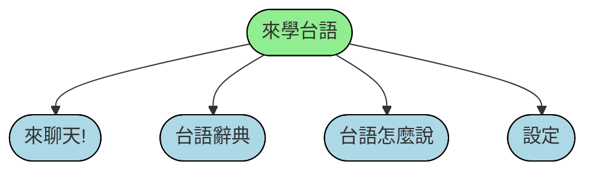

# 小學台語老師給學生回家練習台語的App
智慧型醫學資訊系統實作 2022 fall project
GitHub link: https://github.com/Rainyryan/flutter_hokkien_learning_app.git

## App structure
我們做出了 line_bot 上的 台語 chat bot 之後決定還是用 flutter 試試看，一共做了三個功能。第一個是為了讓小朋友覺得新奇、有趣同時練習台語。第二個是一個方便的辭典，可以查詢課本上的字的意思跟讀法等。第三個是讓小學生在家可以跟長輩用台語溝通的翻譯蒟蒻。

## 1. 來聊天!
台語、國語的語音聊天chat bot。利用實驗室的語音合成 API 把台語的語音輸入轉成文字，再經由 openai  API 利用 "text_davinci-003" chat engine 得到中文回覆，最後再轉成台語語音播出。同時在頁面上顯示對話框。
>這部分用到 dio.dart package 來做 timeout 的處理。
>過程中有遇到一個困難就是 openai 的 API key 一直改動，後來發現應該是因為 key 丟在 github 上被檢查到就會被改掉。ignore 掉才解決。
>

> 錄音按下會變成紅色，再次按下會傳出錄製的訊息

 

## 2. 台語辭典
即時查詢[萌典](https://www.moedict.tw/%E8%90%8C)上的台語詞，http get 拿到 json 之後分別將詞性、註釋、羅馬拼音、範例等資訊顯示出來。並且可以播放每一種讀音(這部分就不是用實驗室的 Api ，因為一個詞會有多種讀音)，做法是用 just_audio.dart package 做 mp3 file playback with remote url. 
>播放的部分一開始用 audioplayers.dart package 實作，但是發現在 ios 上面會無法放出來，最後改用 just_audio 才解決。

> 音符按下可以播放讀音

## 3. 台語怎麼說
上半部可以告訴你一句話的台語或是國語怎麼唸，下半部是一個國台語的翻譯蒟蒻。輸入國語語音，顯示文字並撥出台語語音。或是輸入台語語音，顯示文字並撥出國語語音。用助教上課的demo改的 :P。 :cut_of_meat: 

## 4. 設定
可以看著教授調 Dark Mode 、字體大小等設定(其實只有這兩個)。

